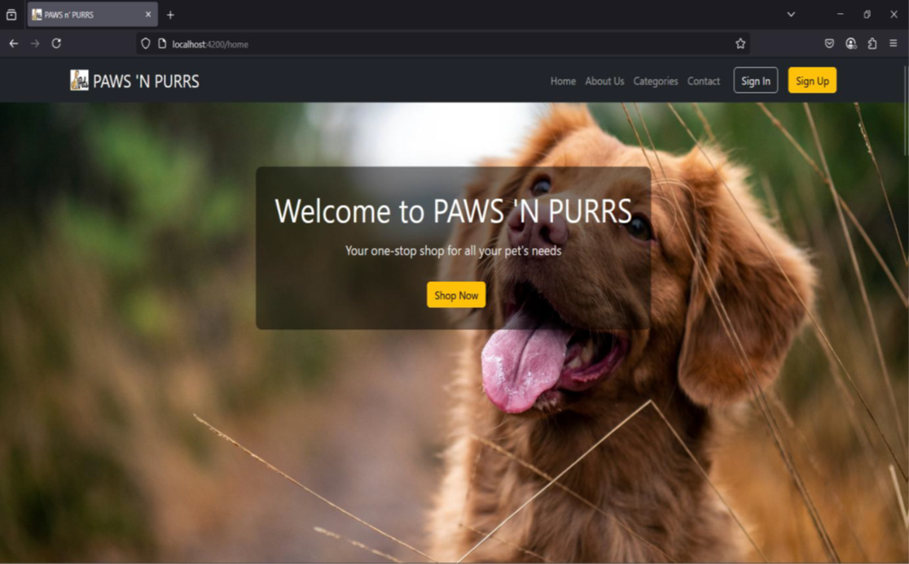
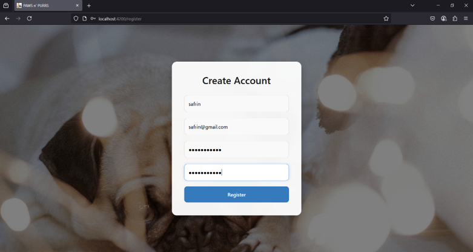
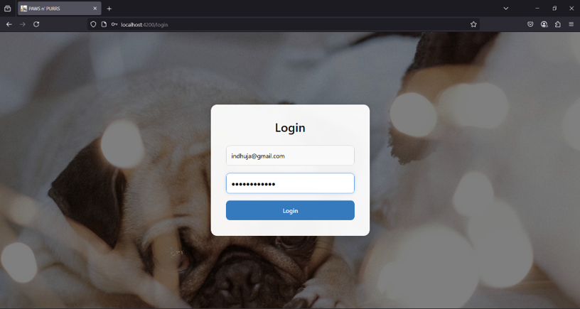
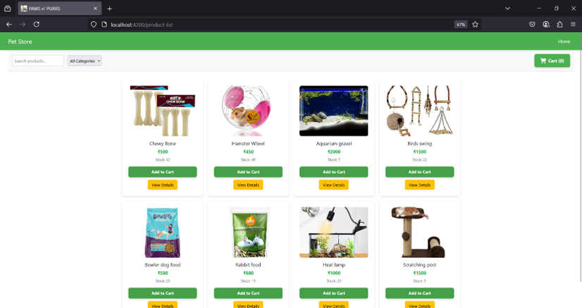
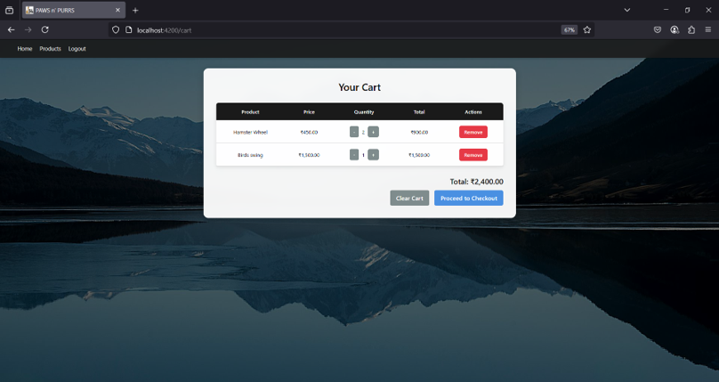
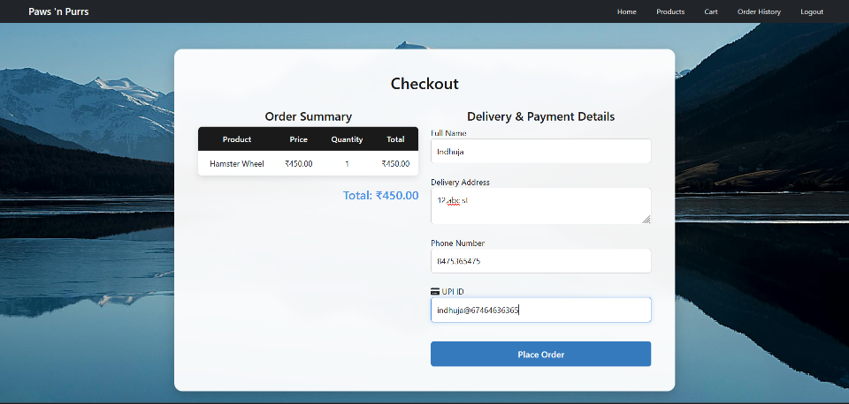
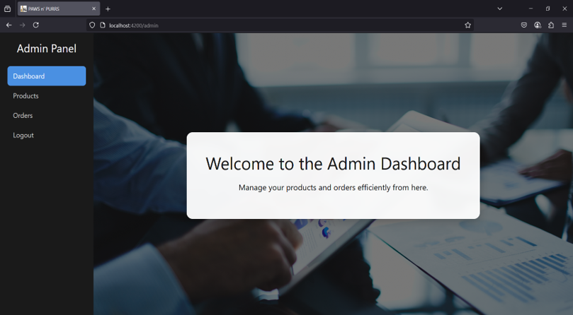
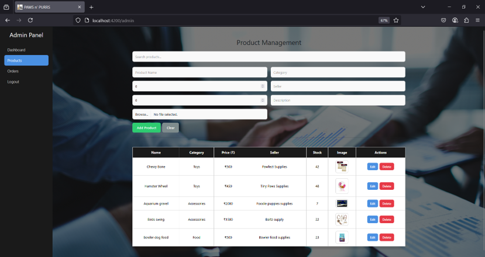

# 🐾 Pet Store Web App (Frontend + Backend)

This is a full-stack e-commerce web application for a pet store built using **Angular 18 (Frontend)** and **Node.js + MongoDB (Backend)**.

---

## Tech Stack

- **Frontend**: Angular 18, HTML, CSS, TypeScript
- **Backend**: Node.js, Express.js
- **Database**: MongoDB
- **Version Control**: Git & GitHub

---

## Features

- 🐶 Product listing with images and prices  
- 🛒 Add to cart & remove from cart  
- 🔍 View product details in a popup  
- 👩‍💼 Admin panel for managing products  
- 📡 API integration with MongoDB backend  

---
## 📸 Screenshots

---
## 📁 Project Structure
project-root/
├── backend/ # Node.js backend server
│ ├── config/ # DB config & environment variables
│ ├── controllers/ # Logic to handle requests/responses
│ ├── models/ # Mongoose models (schemas)
│ ├── routes/ # API route definitions
│ ├── app.js # Main backend entry point
│ ├── package.json # Backend dependencies
│
├── frontend/ # Angular frontend application
│ ├── .angular/ # Angular internal settings
│ ├── .vscode/ # VS Code workspace settings
│ ├── node_modules/ # Frontend dependencies
│ ├── public/ # Static assets
│ └── src/
│ ├── app/ # Angular components and services
│ │ ├── admin-panel/ # Admin features (product mgmt)
│ │ ├── cart/ # Cart component
│ │ ├── checkout/ # Checkout process
│ │ ├── guards/ # Route guards (auth etc.)
│ │ ├── home/ # Homepage UI
│ │ ├── order-history/ # Past orders
│ │ ├── pages/ # Shared/common pages
│ │ ├── product-list/ # Product listings
│ │ ├── profile/ # User profile
│ │ ├── api.service.ts # API integration
│ │ ├── api.service.spec.ts # API test
│ │ ├── app.component.html # Main HTML
│ │ ├── app.component.css # Main styling
│
├── README.md # Project documentation
└── .gitignore # Git ignored files
