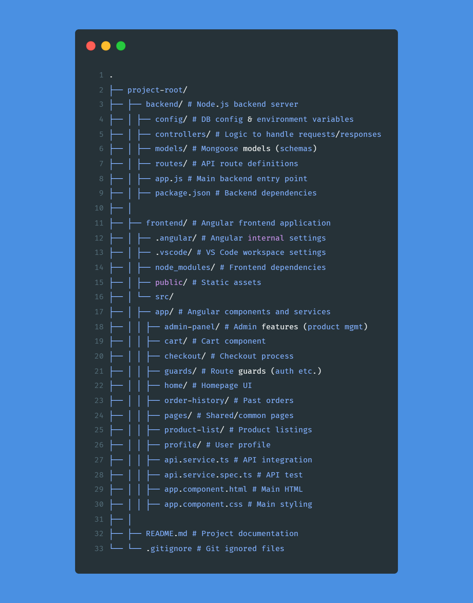

# 🐾 Pet Store Web App (Frontend + Backend)

This is a full-stack e-commerce web application for a pet store built using **Angular 18 (Frontend)** and **Node.js + MongoDB (Backend)**.

---

## Tech Stack

- **Frontend**: Angular 18, HTML, CSS, TypeScript
- **Backend**: Node.js, Express.js
- **Database**: MongoDB
- **Version Control**: Git & GitHub

---

## Features

- 🐶 Product listing with images and prices  
- 🛒 Add to cart & remove from cart  
- 🔍 View product details in a popup  
- 👩‍💼 Admin panel for managing products  
- 📡 API integration with MongoDB backend  

---
## 📸 Screenshots

---
## 📁 Project Structure

